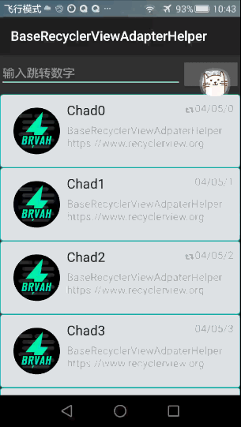
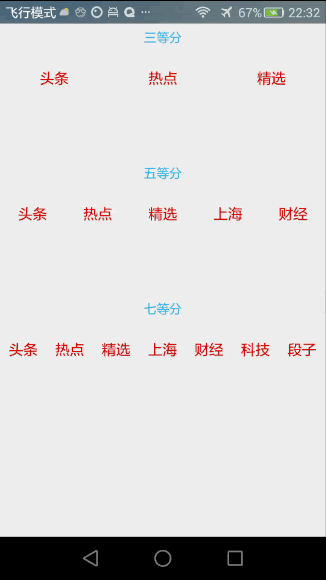

# Recyclerview 常见问题处理(持续更新维护中...)

##1. RecyclerView滚动定位

		经常在开发中，需要将Recyclerview滑动到某个位置，然后定位这一个具体项，将他显示到顶部，用RecyclerView的默认移动的方法并不能实现这一点
		但是，利用LinearLayoutManager,可以很方便的实现这一点。
		不多说，直接上代码
		
	```java
	     int positon ="你指定滚动的位置";
	     layoutManager.scrollToPositionWithOffset(positon,0);
	     layoutManager.setStackFromEnd(true);
	
	```
		
	
	
	```java
	//position 你要指定的滚动位置
	 layoutManager.scrollToPositionWithOffset(postion,0);
	 layoutManager.setStackFromEnd(true);
	```

##2. Recyclerview 动态调整View的宽高 

假如你有 10个item ，产品偶尔会让你一屏幕适配6个 ，剩余的可以滚动
下面介绍两种情况下的处理方案，一种是水平布局，一种是垂直布局


###方便的处理办法1：修改适配器

```java

public class HorizationAdapter extends BaseQuickAdapter<News,BaseViewHolder> {
    private LayoutInflater layoutInflater;
    private int N ;


    public HorizationAdapter(Context mContex, int N) {
        super(item, DataServer.getNews());
        this.N =N;
        layoutInflater =LayoutInflater.from(mContex);
    }


    @Override
    protected void convert(final BaseViewHolder newsViewHolder, final News news) {
        newsViewHolder.setText(R.id.tv_title,news.title);
    }
    @Override
    protected View getItemView(final int layoutResId, final ViewGroup parent) {
        View view = layoutInflater.inflate(R.layout.item_news_title, parent, false);
        view.setMinimumWidth(parent.getWidth() / N);
        LinearLayout.LayoutParams parms = new LinearLayout.LayoutParams(parent.getWidth() / N, ViewGroup.LayoutParams.MATCH_PARENT);
        view.setLayoutParams(parms);
        return view;
    }

}

```
效果图：

